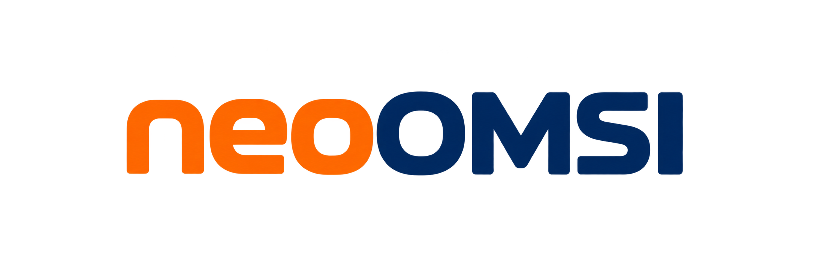

<p align="center">
  <picture>
    <source media="(prefers-color-scheme: dark) and (max-width: 600px)" srcset="assets/logos/neoOMSI-primary-stacked.png">
    <source media="(prefers-color-scheme: dark)" srcset="assets/logos/neoOMSI-wordmark.png">
    
  </picture>
</p>

<p align="center">
  <a href="https://github.com/neoOMSI/neoOMSI/releases/latest"></a>
  <a href="https://github.com/neoOMSI/neoOMSI/actions/workflows/build.yml"></a>
  <a href="https://neoOMSI.github.io/neoOMSI/"></a>
  <a href="https://discord.gg/Gk7EngX6JK"></a>
  <a href="LICENSE"></a>
</p>

<p align="center">
  A community-driven reimplementation of <strong>OMSI 2</strong> in Rust, focused on behavioral compatibility, correctness, and a modern engine.
</p>

> [!WARNING]
> **neoOMSI is in early development.** The codebase is continuously audited and verified against OMSI 2.2.032 subsystem by subsystem. Builds may regress or change without notice.

> [!IMPORTANT]
> **neoOMSI requires an existing OMSI 2 installation.** The project contains no proprietary game content or assets; it loads maps, vehicles, and scripts directly from an installed copy of OMSI 2.

## About neoOMSI

neoOMSI reproduces the observable behavior of **OMSI 2.2.032** while replacing the underlying legacy engine with a clean, modern, multithreaded 64-bit architecture (DirectX 12, Vulkan, and Metal via `wgpu`).

### Goals

* **Behavioral compatibility:** Existing OMSI 2 content (maps, buses, scripts) works accurately out of the box.
* **Modern engine:** 64-bit, multithreaded resource loading, modern graphics APIs, and no arbitrary memory limits.
* **Clean-room implementation:** Independent Rust codebase without proprietary source code, decompiled binaries, or assets.

## Documentation

Detailed documentation and policies live in dedicated guides:

| Guide | Description |
| --- | --- |
| [User guide](docs/USER_GUIDE.md) | How to run neoOMSI, launcher options, and keybindings |
| [Building](docs/BUILDING.md) | Platform prerequisites and build instructions |
| [Contributing](CONTRIBUTING.md) | Guidelines for contributors and PR expectations |
| [Development workflow](docs/DEVELOPMENT.md) | Branching model, review standards, and dev scripts |
| [Compatibility](docs/COMPATIBILITY.md) | Parity policy and OMSI 2 verification process |
| [Issue triage](docs/ISSUE_TRIAGE.md) | How issues are classified, verified, and triaged |
| [Releasing & versioning](docs/RELEASING.md) | Release cadence, nightly builds, and versioning |

## Quickstart

For local development and testing, run the fast development builds:

* **Windows:** `scripts\dev-windows.cmd`
* **macOS:** `sh scripts/dev-macos.sh`

Or compile with Cargo:

```sh
cargo build --release
```

See [Building](docs/BUILDING.md) for platform prerequisites, dev-release builds, and cross-compilation instructions.

## Community

Join our [Discord server](https://discord.gg/Gk7EngX6JK) for questions, discussions, and development updates.

## License and trademarks

- **Source code:** Licensed under the [GNU General Public License v3.0 or later](LICENSE).
- **Documentation:** Licensed under [Creative Commons Attribution-ShareAlike 4.0](docs/LICENSE).
- **Brand & logos:** Protected visual identity; see [TRADEMARKS.md](TRADEMARKS.md).
- **Attribution:** Portions derived from openOMSI; see [NOTICE](NOTICE).

OMSI and OMSI 2 are trademarks of their respective owners. neoOMSI is an independent project and is not affiliated with or endorsed by the original creators.
